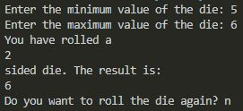

# Overview

This program will roll a dice with user provided numbers. It will also tell the user the number of sides their requested dice has. It demonstrates the use of Python with Visual Studio Code.

# Development Environment

* Visual Studio Code
* Python 3.8.5

# Execution

To execute the program: `python program01.py`

# Useful Websites

* [Python Reference](https://docs.python.org/release/3.8.5/)
