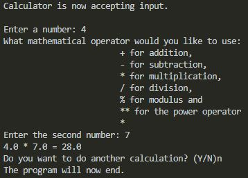

# Overview

This program will perform actions of a basic calculator It demonstrates the use of Python with Visual Studio Code.

# Development Environment

* Visual Studio Code
* Python 3.8.5

# Execution

To execute the program: `python program02.py`

# Useful Websites

* [Python Reference](https://docs.python.org/release/3.8.5/)
