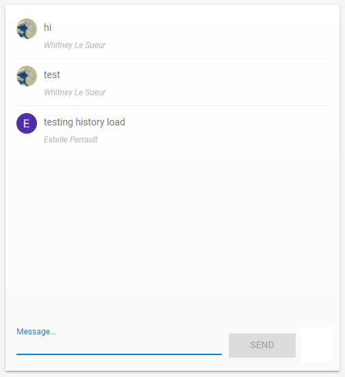

# Overview

This repository holds all the necessary parts to create a simple messaging web app. It demonstrates the use of Google Firebase using Node.js

# Development Environment

* Visual Studio Code
* Node.js 12.19.0 or later

# Execution

These instructions assume you have set up a database with Google Firebase. The project must have Google sign-in enabled for Firebase Authentication.

Preliminary setup to locally host this web app:

* Install the Firebase command line interface `npm -g install firebase-tools`
* Authorize the Firebase CLI `firebase login`
* Associate the directory with a Firebase Project `firebase use --add`

To locally host this web app:
* From the web app directory command line `firebase serve --only hosting`
* You should be able to access the web app from [Here](http://localhost:5000)

# Useful Websites

* [Codelab Firebase Integration Example](https://codelabs.developers.google.com/codelabs/firebase-get-to-know-web/)
* [Node.js 12.19.0 Reference](https://nodejs.org/dist/latest-v12.x/docs/api/)
* [JavaScript Reference](https://developer.mozilla.org/en-US/docs/Web/JavaScript)
* [Firebase Documentation](https://firebase.google.com/docs)
* [MDL Web App Design Tool](https://getmdl.io/customize/)