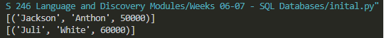

# Overview

This repository holds all the necessary parts to create a simple employee database. This project demonstrates the use of SQLite database using Python. 

# Development Environment

* Visual Studio Code
* Python 3.8.5

# Execution

Run `dbinitial.py` - This will create an employee database file in your current directory.

From within `dbaccess.py` →

* You can create employee variables using the imported Employee class. The class accepts First Name and Last Name as a string and Pay as an integer.

* You can query the database for current values populating the database.

* You can update pay for a given employee

* You can delete a specified employee

Database Query Example:

# Useful Websites

* [SQLite Documentation](https://sqlite.org/docs.html)
* [Python Reference](https://docs.python.org/release/3.8.5/)