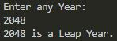
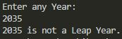
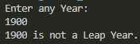

# Overview

This program will determine if a year input by the user is a Leap Year. It demonstrates the use of Java with Visual Studio Code.

# Development Environment

* Visual Studio Code
* Java 1.8.0_231

# Execution

To execute the program: `java LeapYear.java`

# Useful Websites

* [Java Reference](https://docs.oracle.com/en/java/)
* [Visual Studio Code Java Integration](https://code.visualstudio.com/docs/languages/java)