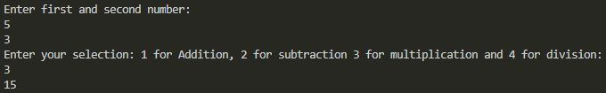

# Overview

This program will perform actions of a basic calculator. It demonstrates the use of Java with Visual Studio Code.

# Development Environment

* Visual Studio Code
* Java 1.8.0_231

# Execution

To execute the program: `java Calculator.java`

# Useful Websites

* [Java Reference](https://docs.oracle.com/en/java/)
* [Visual Studio Code Java Integration](https://code.visualstudio.com/docs/languages/java)
